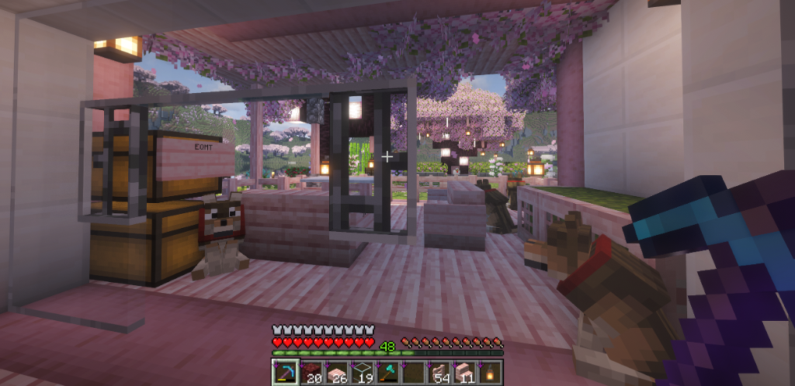
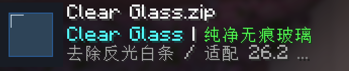



# 🪟 Clear Glass | 纯净无痕玻璃

**A crystal-clear, seamless connected glass resource pack for Minecraft.**  
**一款纯净通透、告别反光白条与拼接黑缝的现代化无缝玻璃材质包。**

[English](#english) | [中文说明](#中文说明)

---

## 📸 效果展示 / Screenshots

### 🎮 游戏内实际效果 / In-Game Showcase
> 从室内透过落地窗眺望庭院樱花与宠物，玻璃通透无杂痕，方块与玻璃板之间完全无缝融合：  
> *Looking out through floor-to-ceiling glass windows at cherry blossoms and pets—no streaks, completely seamless.*

  

 

### 📦 资源包界面 / Resource Pack Menu
> 针对最新 Minecraft 26.2 / 1.21+ 全面优化适配：  
> *Optimized for the latest Minecraft 26.2 / 1.21+ versions.*

  

---

## 🌐 English Description

### 🌟 Key Features

* **💎 100% Streak-Free Crystal View**: Completely removes the annoying reflective diagonal white streaks from vanilla glass. Enjoy an unobstructed, realistic view of your beautiful builds and landscapes.
* **🧩 Full 47-Tile CTM (Connected Textures Mod)**: Features a complete 47-tile CTM set compatible with **Continuity** (Fabric / Quilt) and **OptiFine** (Forge). Adjacent glass blocks merge naturally into seamless panoramic windows.
* **🛡️ Vertical Glass Pane Culling Fix**: Solves the long-standing vanilla Minecraft bug where stacking glass panes vertically creates ugly horizontal divider lines. Built-in custom models add vertical face culling (`cullface`), eliminating seams on top, bottom, and sides alike.
* **🎨 Full Vanilla Support**: Optimizes regular glass as well as all **16 stained glass variants** and **tinted glass**.
* **⚡ Zero Performance Impact**: Pure resource pack structure with zero background scripts or overhead. Fully compatible with **Sodium**, **Iris Shaders**, and **Distant Horizons**.

### 📥 Installation Guide

1. **Prerequisites**:
   * For **Fabric / Quilt**: Install the [Continuity](https://modrinth.com/mod/continuity) mod (and its dependency Fabric API).
   * For **Forge / NeoForge**: Install [OptiFine](https://optifine.net/) or an equivalent CTM mod.
2. **Download**:
   * Grab the latest `Clear Glass.zip` from the [Releases](https://github.com/S1ncerelyJay/minecraft-clear-glass/releases) page.
3. **Apply the Pack**:
   * Place `Clear Glass.zip` into your `.minecraft/resourcepacks/` directory.
   * In-game, navigate to **Options -> Resource Packs...**.
   * Move **Clear Glass** to the **top** (highest priority) of the selected list.
   * Click **Done** and enjoy your crystal-clear views!

---

## 🇨🇳 中文说明

### 🌟 核心特性

* **💎 0 白条纯净透亮**：彻底去除原版 Minecraft 玻璃表面刺眼、遮挡视线的斜向反光白条，无论白天还是夜晚，视野如同空气般清透开阔。
* **🧩 完整 47 格 CTM 无缝连接**：内置完整的 47 贴图 CTM 映射集，深度适配 **Continuity**（Fabric / Quilt）及 **OptiFine**（Forge/NeoForge）。相邻的玻璃方块会自动合并为一体，告别密密麻麻的网格黑边。
* **🛡️ 独家玻璃板垂直接缝剔除修复（Vertical Pane Culling Fix）**：
  * 原版 Minecraft 玻璃板在上下堆叠时，由于模型缺失上下接触面的 `cullface`（面剔除），总会在中间留下难看的横向封边灰线；
  * 本材质包内置了修复后的玻璃板模型，使玻璃板在**上下垂直堆叠**与**水平左右拼接**时均能完美消除缝隙！
* **🎨 全套染色玻璃与遮光玻璃覆盖**：不仅支持普通原版无色玻璃，还全面覆盖了 16 种染色玻璃板/方块以及遮光玻璃。
* **⚡ 极致轻量与零性能损耗**：纯正资源包结构，与 **Sodium（钠）**、**Iris（虹彩光影）**、**Distant Horizons（基岩视距）** 等优化模组完美兼容。

### 📥 安装与使用说明

1. **前置模组**：
   * **Fabric / Quilt 环境**：请确保安装了 [Continuity](https://modrinth.com/mod/continuity) 模组（实现无缝连接玻璃效果）。
   * **Forge / NeoForge 环境**：请确保安装了 [OptiFine](https://optifine.net/) 或支持 CTM 贴图的对应模组。
2. **下载材质包**：
   * 在本项目的 [Releases](https://github.com/S1ncerelyJay/minecraft-clear-glass/releases) 页面下载打包好的 `Clear Glass.zip`。
3. **启用材质包**：
   * 将 `Clear Glass.zip` 放入 `.minecraft/resourcepacks/` 文件夹中。
   * 进入游戏 -> 点击 **选项 -> 资源包**。
   * 将 **Clear Glass** 移动到已选资源包列表的**最顶层（最高优先级）**。
   * 点击 **完成** 即可进入游戏体验！

---

## 📜 开源协议 / License

本项目遵循 [MIT License](LICENSE) 开源协议。您可以自由使用、修改及在整合包中分发。
